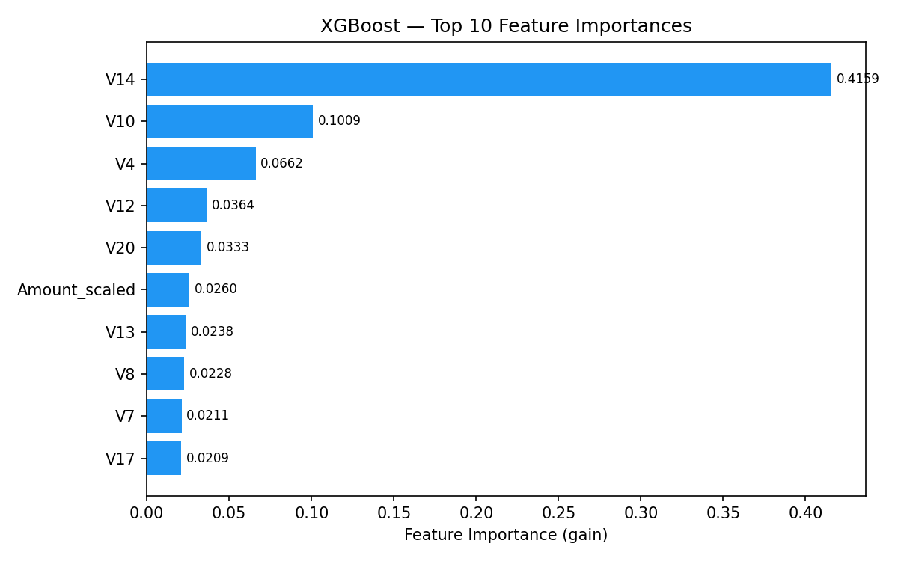

# 🏦 Hybrid AI Risk Monitoring System

A production-style merchant risk control platform combining Machine Learning and rule-based engines to detect fraudulent transactions in real time.

> This project was built to explore how real-world fraud detection systems are architected beyond ML models — using XGBoost with `scale_pos_weight` to handle severe class imbalance in fraud data, combined with a rule-based engine and a clean service layer into a maintainable, scalable platform.

---

## 🚀 Live Demo

[▶️ Watch Demo on YouTube](https://www.youtube.com/watch?v=jWTEc0SSOKM)

---

## 📊 Model Performance

Both models are threshold-tuned to maintain **Recall ≥ 90%** on the held-out test set (20% stratified split, `random_state=42`).

| Metric | Logistic Regression | XGBoost | Improvement |
|---|---|---|---|
| AUC | 0.9714 | **0.9782** | +0.0068 |
| Precision | 8.8% | **13.9%** | **+58%** |
| Recall | 90.8% | 90.8% | — |
| F1 | 0.1606 | **0.2412** | **+50%** |
| False Positives | 921 | **551** | **−40%** |

> At equal Recall (90.8% fraud caught), XGBoost reduces false positives by 40% — meaning 40% less manual review workload per day.

---

## 🔍 Key Findings

### Feature Importance



| Rank | Feature | Importance |
|---|---|---|
| 1 | V14 | 41.6% |
| 2 | V10 | 10.1% |
| 3 | V4 | 6.6% |
| 4 | V12 | 3.6% |
| 5 | V20 | 3.3% |
| 6 | Amount_scaled | 2.6% |

- **V14 is the dominant fraud signal**, contributing 41.6% of XGBoost's decision weight — more than the next four features combined.
- **Behavioral features (V14, V10, V4) far outweigh transaction amount**, confirming that fraud detection should prioritise behavioral pattern analysis over amount-based thresholds.

---

## 🧠 System Architecture

```
MERCHANT_RISK_AI/
├── app/
│   └── dashboard.py          # Streamlit Risk Control Center
├── data/
│   └── raw/
│       └── creditcard.csv    # Kaggle fraud dataset (not included)
├── src/
│   ├── core/
│   │   ├── schema.py         # Data enrichment (merchant/customer IDs)
│   │   ├── governance.py     # Data cleaning & validation
│   │   └── features.py       # ML feature engineering
│   ├── models/
│   │   ├── fraud_model.py    # Logistic Regression baseline
│   │   └── xgb_model.py      # XGBoost classifier
│   ├── risk/
│   │   ├── rule_engine.py    # Rule-based risk scoring
│   │   ├── risk_engine.py    # Hybrid score = rule_risk + ml_probability
│   │   └── risk_metrics.py   # KPIs, rankings, trends
│   ├── services/
│   │   ├── pipeline.py       # End-to-end orchestration
│   │   └── analytics_service.py  # Clean API for dashboard
│   └── ai/
│       └── agent.py          # AI agent layer
├── evaluate.py               # LR vs XGBoost evaluation script
└── requirements.txt
```

---

## ⚙️ How It Works

The system uses a **two-stage hybrid scoring approach**:

- **Stage 1 — Rule Engine** — flags transactions based on amount thresholds ($200 / $1,000 / $3,000), customer velocity, and time-of-day patterns (00:00–05:00 off-hours). Provides an auditable, domain-driven floor independent of the ML model.
- **Stage 2 — XGBoost Classifier** — trained on V1–V28 PCA behavioral features + Amount_scaled, with `scale_pos_weight=577` to handle the 0.17% fraud rate. Decision threshold tuned for Recall ≥ 90%.
- **Final Risk Score** = `0.35 × rule_risk + 0.65 × ml_probability` (normalized to [0, 1])

Risk tiers: `HIGH ≥ 0.70` → immediate review · `MEDIUM ≥ 0.40` → monitor · `LOW < 0.40` → normal

---

## 📊 Dashboard Features

- KPI row: avg risk, fraud rate, high-risk count
- Risk score distribution histogram
- Daily risk trend (dual-axis)
- Merchant risk ranking table
- High-risk transaction table with full score breakdown
- Sidebar: merchant filter + risk threshold slider

---

## 🛠 Setup

```bash
# 1. Clone the repo
git clone https://github.com/katewxy/MERCHANT_RISK_AI.git
cd MERCHANT_RISK_AI

# 2. Download dataset
# Get creditcard.csv from Kaggle and place in data/raw/

# 3. Install dependencies
pip install -r requirements.txt

# 4. Run dashboard
streamlit run app/dashboard.py

# 5. Run model evaluation
python evaluate.py
```

---

## 📦 Tech Stack

| Component | Technology |
|-----------|-----------|
| Dashboard | Streamlit + Plotly |
| ML Models | XGBoost 2.1 + Scikit-learn Logistic Regression |
| Feature Engineering | pandas, scikit-learn StandardScaler |
| Data | Kaggle Credit Card Fraud Dataset |
| Language | Python 3.9+ |

---

## 📁 Dataset

This project uses the [Kaggle Credit Card Fraud Detection dataset](https://www.kaggle.com/datasets/mlg-ulb/creditcardfraud).
Download and place at `data/raw/creditcard.csv` before running.
